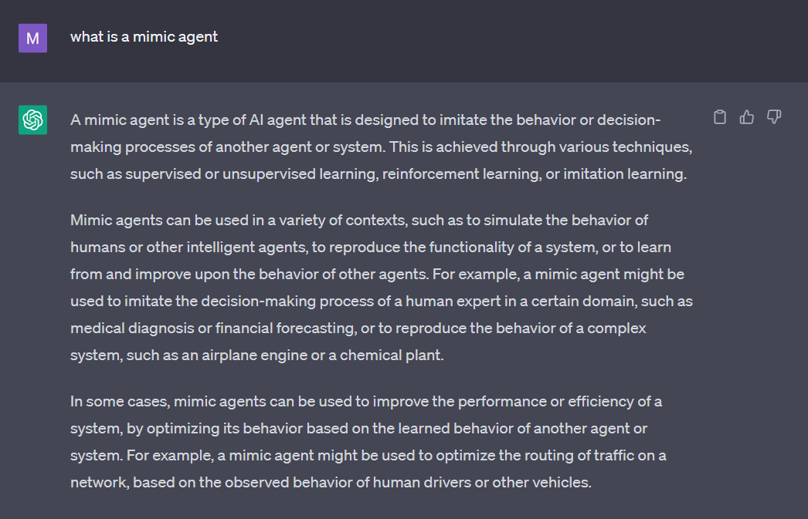
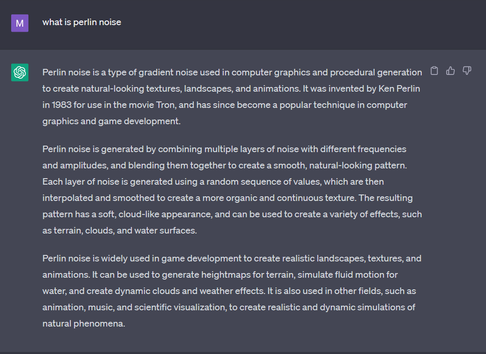

# Final Project Report
Submission: Manasi Patil - msp5561
## Abstract
This project is a simple game developed using pygame that uses artificial intelligence to provide an adventurous gameplay. The game follows Oillill, an elf who set out to build a new life for themselves. The player needs to help Oillill reach their destination by travelling through the treacherous landscape of mountains and water-bodies, frequently encountering robbers. The player must make wise decisions when choosing the next route to take and when fighting with the robbers to ensure that they do not run out of money or health. Travelling uphill and losing a combat costs Oillill money whereas going downhill and winning a combat makes Oillill gain money. The player is not permitted to go to a city that is not connected to the current city by a route. The game ends when Oillill reaches their destination, or runs out of money. 
## AI Components
1. AI Player
2. AI Combat Player - mimic agent
3. Landscape generation using Perlin Noise
4. Dynamic dialogue generation
## Problems Solved
1. It is possible to play this game using AI. While the default mode is that the player chooses the next destination as well as the moves during a combat, an AI agent can also play the game. It can do this by generating an optimal policy for combats by using the Monte Carlo method. This includes running 100 turns to generate a dataset of the state (player and opponent health), action taken, and reward. Then using this, the agent can choose an optimal action for it's current state.
2. When there is a combat, the player has to play against an AI Combat Player. This AI Combat Player is a simple mimic agent. A mimic agent is a type of AI agent that is designed to imitate the behavior or decision-making processes of another agent or system (Appendix A). In this case, the AI Combat Player mimics the player's previous move during the combat.
3. In order to generate a landscape that has varying elevations, the use of Perlin Noise was made. Perlin noise is a type of gradient noise used in computer graphics and procedural generation to create natural-looking textures, landscapes, and animations (Appendix B). Every gameplay generates a unique landscape so everytime a player plays, they get a new experience. 
4. When the player loses or wins, a message is outputted to the console. The ntlk.chat.util library was used for this purpose. ChatGPT was asked to generate some messages to say to the player in case they win or lose. These messages were used while implementing this feature.
## Appendix
### Appendix A

### Appendix B
